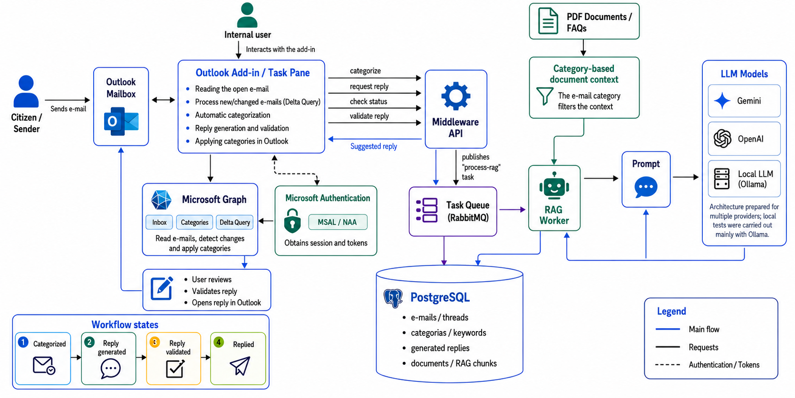
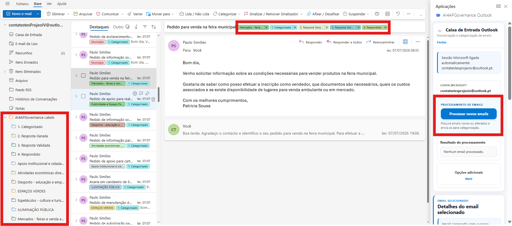
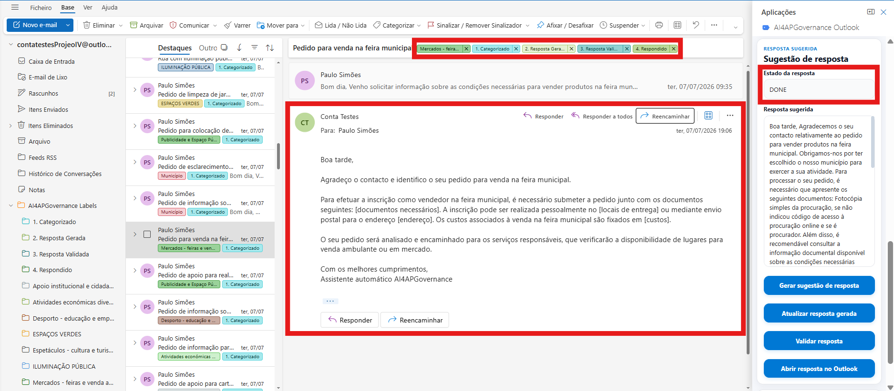
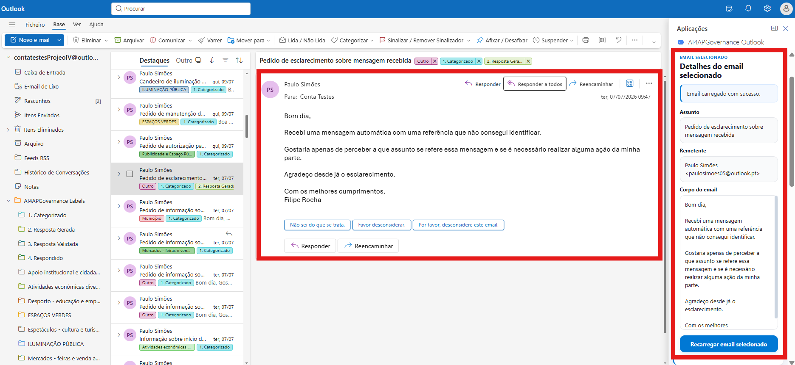
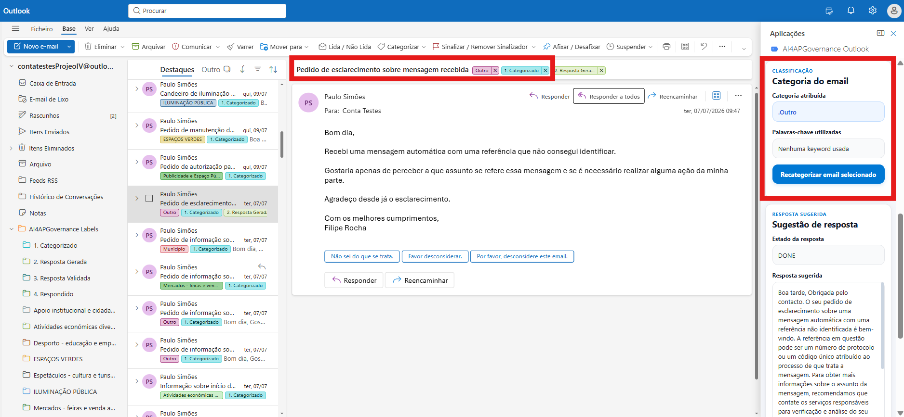
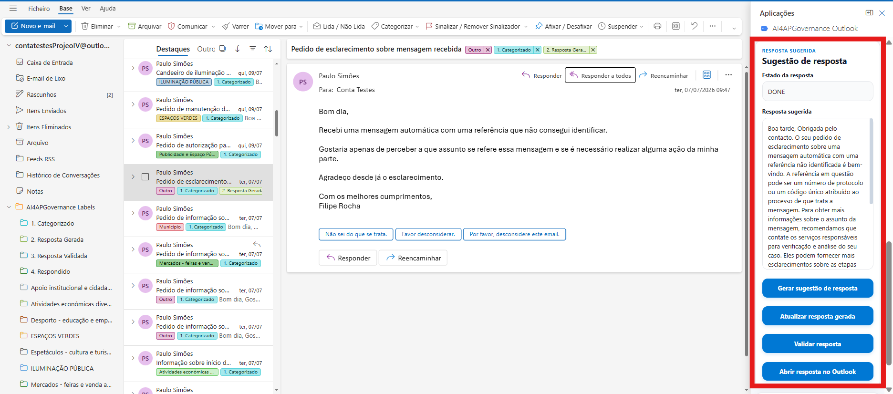
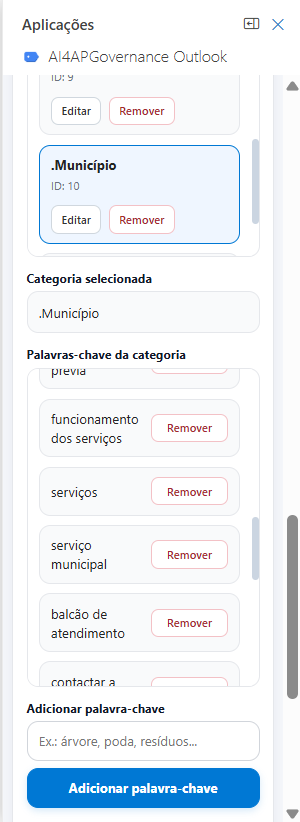

# 📩 Open-Source Plugin for E-mail Automation using Large Language Models - A proposal
Originally developed for Gmail and later extended with a Microsoft Outlook Add-in.

## Architecture Diagram
The original architecture was designed for the Gmail add-on.  
The project was later extended with a Microsoft Outlook Add-in that reuses the same backend, database, RAG workflow and LLM components.

<p align="center">
    
</p>

### Outlook Add-in Architecture
The Outlook implementation introduces Microsoft Graph, MSAL/NAA authentication, Delta Query processing and an Outlook task pane while preserving the existing Middleware API, PostgreSQL database, RabbitMQ queue and RAG Worker.

<p align="center">
    
</p>

## 📚 Project Context

This project provides an open-source solution for automating e-mail categorization and assisting users with the generation of institutional replies using Large Language Models and Retrieval-Augmented Generation (RAG).

The original version of the project was designed as a Gmail add-on. It was later extended with a Microsoft Outlook Add-in, implemented as an Outlook task pane and integrated with Microsoft Graph.

The system can:

- read and process e-mails;
- automatically categorize messages using categories and keywords;
- detect new or changed Outlook messages through Microsoft Graph Delta Query;
- retrieve category-related context from PDF documents and FAQs;
- generate suggested replies using a RAG workflow;
- allow users to review and validate replies before opening them in Outlook;
- track the e-mail workflow through categorization and reply-status categories.

The Outlook implementation communicates with the existing Middleware API and uses PostgreSQL for data persistence, RabbitMQ for asynchronous RAG jobs, and a dedicated RAG Worker for document retrieval and reply generation.

The current local implementation was tested mainly with Ollama and a local language model. The architecture can be extended in the future to support external LLM providers such as OpenAI or Gemini.

## 🚀 Project Deploy

### Gmail

Once the Gmail add-on is fully developed, it can be published through Google Workspace and installed directly in Gmail.

### Outlook

The Microsoft Outlook Add-in is currently executed in a local development environment using Office.js, Microsoft Graph and an HTTPS development server. It can be sideloaded into Outlook for testing.

## ✨ Main Features


### 1. Categorized Mailbox

**Gmail:**
<p>
    
</p>

**Outlook:**

<p>
    
</p>

In Outlook, categories are applied directly to messages through Microsoft Graph. The Add-in also creates visual workflow categories and optional Outlook label folders.

### 2. Suggested Reply Generation

**Gmail:**
<p>
    
</p>

**Outlook:**
<p>
    
</p>

## 📬 Microsoft Outlook Add-in Extension

### Outlook Task Pane

The Outlook version is implemented as a task pane integrated into Microsoft Outlook.

### Microsoft Authentication

Microsoft authentication is performed using MSAL and Nested App Authentication. The Add-in obtains a Microsoft Graph access token to read messages, apply categories and detect Inbox changes.

### Microsoft Graph Integration

Microsoft Graph is used to:

- read the currently opened e-mail;
- read Inbox messages;
- apply and replace Outlook categories;
- mark processed e-mails as read;
- create Outlook master categories;
- create label folders;
- process new or changed messages through Delta Query.

### Delta Query Processing

The Add-in uses Microsoft Graph Delta Query to detect messages that are new or have changed since the previous synchronization.

In the current implementation, new messages are categorized automatically. Previously categorized messages are detected but are recategorized manually to avoid overwriting user corrections after changes such as read status, flags or workflow categories.

### Category and Keyword Management

Users can create, edit and delete categories, as well as add or remove keywords.

When a category is deleted:

- its keywords are removed;
- associated threads are reclassified as `.Outro`;
- the old Outlook category is replaced with `Outro`;
- workflow categories remain unchanged.

### RAG-Based Reply Generation

The Outlook Add-in reuses the existing Middleware API, RabbitMQ queue, PostgreSQL database and RAG Worker.

The RAG Worker retrieves document chunks related to the e-mail category, builds the prompt and sends it to the configured LLM.

The current implementation was tested mainly with a local model through Ollama.

## 🔄 Outlook Workflow States

The Outlook Add-in uses the following categories to represent the processing state of each e-mail:

1. `1. Categorizado`
2. `2. Resposta Gerada`
3. `3. Resposta Validada`
4. `4. Respondido`

In the current implementation, opening the generated reply in Outlook creates or displays a draft but does not guarantee that the message was actually sent. Automatic confirmation through the Sent Items folder, using Microsoft Graph Webhooks or Delta Query, is proposed as a future improvement.

## 🖼️ Outlook Add-in Screenshots

### Main Interface


### Selected E-mail Details



### Assigned Category



### Suggested Reply



### Category and Keyword Management



### Validated Reply


## 🚀 Running the Outlook Add-in Locally

The Outlook environment requires:

1. PostgreSQL with the project schema and data
2. RabbitMQ
3. Ollama
4. Middleware API
5. RAG Worker
6. Outlook development server
7. A configured Microsoft Azure App Registration

### 1. Install dependencies

Install the dependencies in both project components:

```bash
cd middleware-api
npm install
```

```bash
cd outlook
npm install
```

### 2. Configure the environment

Create a `.env` file inside the `middleware-api` directory:

```env
PORT=4000
DATABASE_URL=<postgresql-connection-string>
PGVECTOR_URL=<pgvector-connection-string>
API_SECRET=<api-secret>
JWT_SECRET=<jwt-secret>
RABBITMQ_URL=amqp://localhost
AZURE_TENANT_ID=consumers
AZURE_CLIENT_ID=<azure-client-id>
AZURE_CLIENT_SECRET=<azure-client-secret>
```

The Azure configuration must correspond to an App Registration configured for the Outlook Add-in and Microsoft Graph.


The Outlook frontend also requires the Microsoft client ID in its local MSAL configuration file.

### 3. Configure PostgreSQL

Create an empty PostgreSQL database and execute the initialization script included in the repository:

```text
database/init.sql
```

The script creates:

- the `pgvector` extension;
- all project tables and sequences;
- primary and foreign key constraints;
- database functions and triggers;
- the RAG document and embedding tables;
- the default categorization and reply types.

#### Using pgAdmin

1. Create a new PostgreSQL database.
2. Select the database and open **Query Tool**.
3. Load `database/init.sql`.
4. Execute the complete script.

#### Using psql

```bash
psql -U <postgres-user> -d <database-name> -f database/init.sql
```

After running the initialization script, register the Outlook implementation:

```sql
INSERT INTO implementacao (email, plataforma)
VALUES ('<outlook-account>', 'Outlook');
```

The database trigger automatically creates the default `.Outro` category for the new implementation.

Finally, configure the database connection strings in `middleware-api/.env`:

```env
DATABASE_URL=postgresql://<user>:<password>@localhost:5432/<database-name>
PGVECTOR_URL=postgresql://<user>:<password>@localhost:5432/<database-name>
```

PostgreSQL must have the `pgvector` extension installed.

### 4. Start RabbitMQ

Create the RabbitMQ container:

```bash
docker run -d --name rabbitmq -p 5672:5672 -p 15672:15672 rabbitmq:4-management
```

If the container already exists:

```bash
docker start rabbitmq
```

The RabbitMQ management interface is available at `http://localhost:15672`.

### 5. Configure Ollama

Make sure Ollama is installed and running locally.

Install the required models:

```bash
ollama pull llama3
ollama pull nomic-embed-text
```

Confirm that the models are available:

```bash
ollama list
```

### 6. Start the Middleware API

In a new terminal:

```bash
cd middleware-api
node src/app.js
```

The API runs on port `4000` by default.

### 7. Start the RAG Worker

In another terminal:

```bash
cd middleware-api
node src/worker/worker.js
```

### 8. Start the Outlook Add-in

In another terminal:

```bash
cd outlook
npm run dev-server
```

The task pane is served locally through HTTPS and can be sideloaded into Outlook.